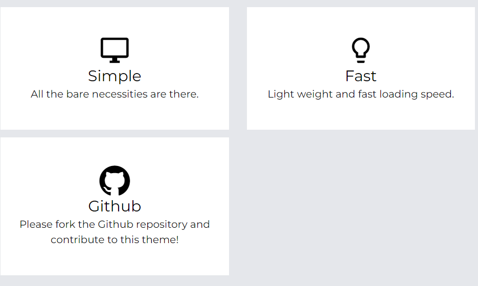

# HomePage

# Overview

init8-jpの公式ホームページです.  
[init8.jp](https://www.init8.jp)  

# Requirement

[hugo](https://gohugo.io)  

# Development

- data/slide.json  

ホームページ最初のスライド画像の定義  

- data/features.json  

  
の部分を編集可能です  
詳しくは[exampleSite](https://github.com/opera7133/tella/tree/master/exampleSite)をご覧ください  

- config.toml  

hugo全般の設定ファイルです  
詳しくは[こちら](https://gohugo.io/getting-started/configuration/)  

- content/*  
ページの追加はこの部分で行います  

ex. content/blog/hello.md -> https://init8.jp/blog/hello  
この例で/blogにアクセスすると配下のページ一覧が出せます  

- static/*  

静的データ(ex. 画像)を扱えるようにします  
ex. static/img/hello.png -> https://init8.jp/img/hello.png  
content配下のマークダウンからは/img/hello.pngのように扱えます  

- layouts/*  

markdownで扱うのが難しいもしくはhtmlを書くしかなくなってしまうような場面で活用します  
詳しくは[こちら](https://gohugo.io/templates/)  
